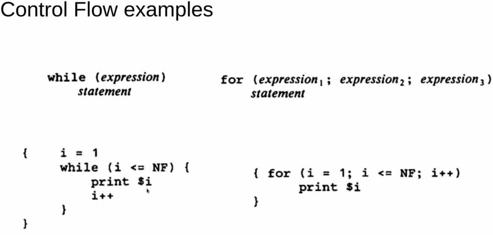

# AWK

## Hello World in AWK
```awk
awk 'BEGIN { print "Hello, world!"}'
```

## Run an awk program
* awk 'program' input files
* awk -f progfile input files
* some_command | awk 'program'

* #!/usr/bin/env awk -f
* ./script.awk *.log

## AWK program structure

* `pattern { action }`

* either pattern or action can be ommitted.

* No Pattern - match every line:
```awk
'{ print $1 }'
```

* No Action? - print every line matched
```awk
'/regex/'
```

## AWK Patterns
* Basically "if" statements
* If true - execute action
* If false - skip action. test next line

## AWK Pattern Reference


## AWK Range Patterns
* two patterns separated by a comma
* matches a line between occurence of pattern 1 and next occurence of pattern 2 inclusive
* no pattern 2 found? *all* lines to end of input are matched

## AWK Patterns Summary


## AWK Actions
* Executed if pattern matches
* Access to a number of built in variables
* Parenthesis in function calls are optional
* Can override fields or cre4ate new fields


## Simple AWK Programs
* Normally seen
```awk
awk '{print $2}'
```
Or
```awk
awk `$3 == 10`
```

* Print every line
```awk
awk ' {print }'

# also

awk ' { print $0 } '
```

* Print some columns
```awk
awk ' { print $1, $3 }'
```

* Column Math
```awk
awk ' { print $1, $$2 * $3 }'
```

* What is a column? Whitespace by default
* OFS (Output Field Separator) - default is whitespace

## AWK Built in variables


* **FS** - Field Separator
* **NF** Number of fields

## AWK - Magic Variables
* Print no of columns
```awk
awk '{ print NF } '
```

* Print no of lines
```awk

# Print Record number, followed by the entire line
awk ' { print NR, $0 } '
```

## AWK - Adding text to output
* Print number of fileds (columns)
```awk
awk '{ print $1 "makes" $3 "per hour" }'
```

* printf style
```awk
awk '{ printf("%s makes $%.2f per hour\n", $1, $3) }'
```

## AWK Combine with sort / uniq
* Sort the output by $per hour (3rd column)
```
awk '{print $1 "makes" $3 "per hour"}' | sort -nk 3
```

* Filter on unique wages
```
awk '{ print $1 "makes" $3 "per hour" }' | uniq -f 2
```

## AWK Expressions Reference


## AWK - Built in Math Functions


## AWK - String functions


## AWK - String Functions
* implicit $0 if no args passed


## AWK - String Concatenation


## AWK - Types
* 2 types - strings & Numbers


## AWK - Expression Operators


## AWK - Control Flow Statements
* A Programming Language!!!!


## AWK - Control Flow Examples


## AWK _ Output Statements

* Close files when you are not using them
* system - a command to esxecute in shell

## AWK - Format string reference (printf)


## AWK - Write Files / Pipe


* We can write files directly from awk

* You can **PIPE** output to anohter command

## AWK- Variables

* **NOTE** - Length is a fucntion - remember - you don't need parentheses for functions in AWK

## AWK - Calling Functions


## AWK - Define Functions


## AWK - Arrays

* one dimensional
* **ASSOCIATIVE** - MAPS!!!!!

## AWK - Field Manipulation


## AWK - Self contained scripts
```
#!/usr/bin/awk -f 

{ print $0 }

# -f the argument is the fiel to read from
```


## AWK - Weird AWK Stuff
```awk
awk '{ $1=$1 }1' file.txt

```

Equivalent to:  
```
awk ' { $1=$1 }; { print }' file.txt

# purpose - strip leading white space
#
# take first col & assign to first col
# FS = whitespace
# When assigning to $1, awk will strip whitespace (separator)
# and assign remaing to $1
#
# the ending 1 - since 1 evals to true, it will print out the entire line
```

## Reference

Sourced from the [Awk: Hack the planet['s text]!](https://youtu.be/43BNFcOdBlY)